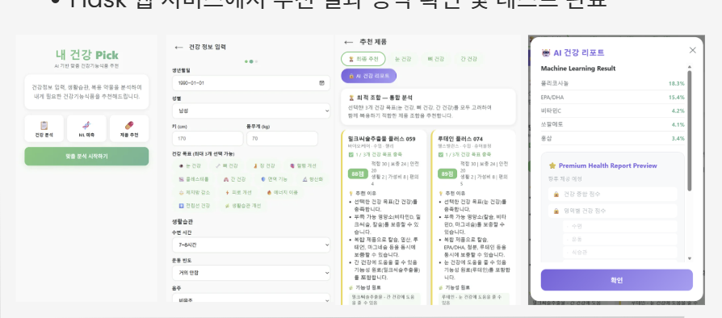

# MyNutri

> 개인 건강정보와 생활습관을 기반으로 **부족 가능 영양소를 분석하고 건강 목표에 맞는 건강기능식품을 추천하는 웹 서비스**

사용자의 건강정보와 생활습관을 입력받아 부족 가능 영양소를 분석하고,  
건강 목표와 제품 성분 정보를 함께 고려하여 건강기능식품을 추천하도록 구현했습니다.

Flask를 활용해 입력 → 분석 → 추천 결과 확인까지 하나의 웹 서비스로 연결했습니다.

> **Note**  
> 본 프로젝트는 학습 및 서비스 구현을 목적으로 수행한 프로젝트입니다.  
> 분석 및 추천 결과는 질병의 진단이나 치료를 위한 의료적 판단을 제공하지 않습니다.

---

## 🖥️ 서비스 구현 화면



**건강정보 입력 → 부족 가능 영양소 분석 → 건강기능식품 추천 → 분석 결과 확인**의 흐름으로 구현했습니다.

---

## 📌 프로젝트 개요

### 문제 정의

건강기능식품을 선택할 때 사용자는 자신의 생활습관과 건강 상태에 어떤 영양소가 필요한지,  
또 여러 제품 중 어떤 제품이 자신의 건강 목표에 적합한지 판단하기 어렵습니다.

MyNutri는 이를 바탕으로 다음 과정을 하나의 서비스로 구현했습니다.

1. 개인 건강정보 및 생활습관 입력
2. 부족 가능 영양소 분석
3. 건강 목표와 영양성분을 고려한 제품별 적합도 계산
4. 적합도가 높은 건강기능식품 추천
5. 웹 화면에서 분석 및 추천 결과 제공

---

## 🔄 분석 및 추천 프로세스

```text
사용자 건강정보 · 생활습관 입력
              ↓
       입력 데이터 처리
              ↓
   부족 가능 영양소 분석
      ├─ Rule-based 분석
      └─ Random Forest 예측
              ↓
건강 목표 · 영양성분 · 생활습관 등을
       반영한 제품 점수 계산
              ↓
       추천 후보 제품 선정
              ↓
       최종 조합 추천
              ↓
        Flask 결과 출력
```

---

## 📊 데이터

프로젝트에서는 두 종류의 데이터를 사용했습니다.

### 1. PHR 형태의 건강 데이터

건강정보와 생활습관을 포함한 **합성 PHR 데이터**를 활용했습니다.

주요 변수에는 다음과 같은 정보가 포함됩니다.

- 연령 및 성별
- BMI
- 혈압
- 혈당
- 수면시간
- 운동
- 흡연 및 음주
- 건강 상태 관련 변수

해당 데이터는 실제 환자의 임상 데이터가 아닌 **프로젝트 학습을 위한 합성 데이터**입니다.

### 2. 건강기능식품 데이터

제품 추천에는 정리된 건강기능식품 데이터를 사용했습니다.

```text
01_product_items_100_clean.csv
02_functional_ingredients_100_clean.csv
03_nutrition_facts_100_clean.csv
04_label_information_100_clean.csv
```

제품 기본정보, 기능성 원료, 영양성분 등의 정보를 연결하여 추천 과정에 활용했습니다.

---

## 🧠 부족 가능 영양소 분석

사용자의 건강정보와 생활습관으로부터 부족 가능성이 있는 영양소를 분석했습니다.

### Rule-based 분석

수면시간, 야외활동, 식습관, 흡연·음주 등의 조건을 이용하여  
부족 가능 영양소를 판단하는 규칙 기반 분석을 구현했습니다.

### Random Forest

규칙을 기반으로 생성한 학습 라벨을 이용하여  
Random Forest 기반 **multi-label classification**을 적용했습니다.

예측 결과는 부족 가능 영양소 분석 과정에 활용하고,  
해당 결과를 건강기능식품 추천 로직과 연결했습니다.

> 이 모델의 라벨은 실제 임상 진단 결과가 아니라 프로젝트에서 정의한 규칙을 기반으로 생성되었습니다.  
> 따라서 모델의 예측 성능은 실제 의료 환경에서의 임상적 예측 성능을 의미하지 않습니다.

---

## 💊 건강기능식품 추천

분석된 정보와 제품 데이터를 결합하여 제품별 추천 점수를 계산했습니다.

추천 과정에서는 다음 정보를 활용합니다.

- 사용자의 건강 목표
- 부족 가능 영양소
- 제품의 기능성 원료
- 제품의 영양성분
- 생활습관 적합성
- 복용 편의성

각 제품의 조건을 비교한 뒤 적합도가 높은 제품을 추천 후보로 선정하고,  
건강 목표별 추천 및 최종 제품 조합을 제공합니다.

---

## 📈 모델 평가

`nutrition_model_report.txt`에 저장된 평가 결과는 다음과 같습니다.

| 항목 | 결과 |
|---|---:|
| 데이터 수 | 12,650 |
| Feature 수 | 40 |
| Label 수 | 17 |
| Macro F1 | 0.9368 |
| Micro F1 | 0.9984 |

### 결과 해석 시 주의사항

본 결과는 **합성 PHR 데이터와 규칙 기반으로 생성한 라벨**을 대상으로 한 평가 결과입니다.

따라서 높은 F1 Score를 실제 환자의 영양 상태를 예측하는 임상적 성능으로 해석할 수 없습니다.  
본 모델링의 목적은 정의한 규칙으로 생성된 패턴을 머신러닝 모델이 학습하고 재현하는 과정을 구현하고, 이를 추천 서비스와 연결하는 데 있습니다.

---

## 🛠️ 기술 스택

| 구분 | 사용 기술 |
|---|---|
| Language | Python |
| Data Processing | pandas, NumPy |
| Machine Learning | scikit-learn, Random Forest |
| Model Management | joblib |
| Web | Flask |
| Visualization | Matplotlib |

---

## 📁 프로젝트 구조

```text
MyNutri/
├── app.py
├── train_models.py
├── train_random_forest.py
├── requirements.txt
│
├── config/
│   └── health_goal_mapping.json
│
├── templates/
│   └── index.html
│
├── docs/
│   └── mynUTri-service.png
│
├── 01_product_items_100_clean.csv
├── 02_functional_ingredients_100_clean.csv
├── 03_nutrition_facts_100_clean.csv
├── 04_label_information_100_clean.csv
│
├── SYNTHETIC_PHR_MEDICAL_v4_FINAL_KR_HEADER.csv
└── nutrition_model_report.txt
```

대용량 학습 모델(`*.pkl`)은 저장소에 포함하지 않았으며, 학습 코드를 통해 생성할 수 있도록 구성했습니다.

---

## 🚀 실행 방법

### 1. 가상환경 생성 및 패키지 설치

Windows 기준:

```bash
python -m venv .venv
.venv\Scripts\activate
pip install -r requirements.txt
```

### 2. 모델 생성

```bash
python train_models.py
python train_random_forest.py
```

학습된 모델 파일은 로컬 환경에서 생성됩니다.

### 3. Flask 앱 실행

```bash
python app.py
```

실행 후 브라우저에서 `http://127.0.0.1:5000`으로 접속합니다.

---

## ⚠️ 프로젝트 한계

- 실제 환자 데이터가 아닌 합성 PHR 데이터를 사용했습니다.
- 부족 가능 영양소 학습 라벨은 프로젝트에서 정의한 규칙을 기반으로 생성했습니다.
- 모델 성능을 실제 임상적 예측 성능으로 일반화할 수 없습니다.
- 추천 결과는 의료적 진단이나 치료 목적이 아닌 학습 프로젝트의 결과입니다.
